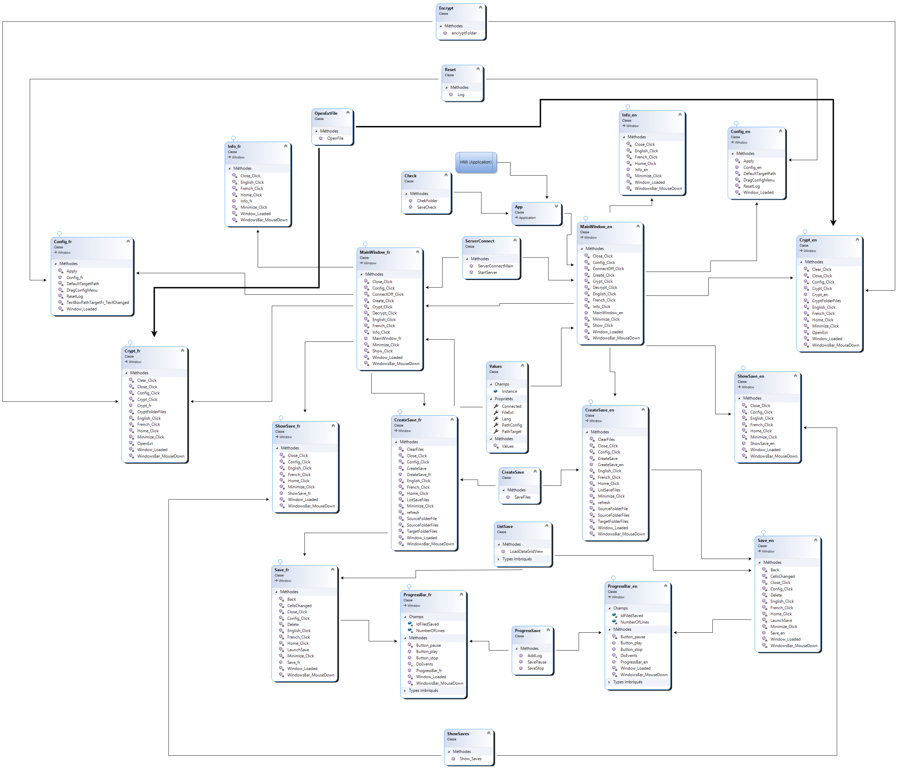

<div align="center">

  <h1>EasySave</h1>

  <p>
    Suite logicielle de sauvegarde de fichiers developpee pour un client fictif, ProSoft, dans le cadre d'un projet d'ecole (CESI)
  </p>

<p>
  
  
  
</p>

</div>

<br />

## Table des matieres

- [A propos](#a-propos)
  - [Architecture](#architecture)
  - [Diagrammes](#diagrammes)
  - [Stack technique](#stack-technique)
  - [Fonctionnalites](#fonctionnalites)
- [Demarrage](#demarrage)
  - [Prerequis](#prerequis)
  - [Installation](#installation)
  - [Lancer le projet](#lancer-le-projet)
- [Contact](#contact)

## A propos

EasySave est une suite de 4 logiciels developpes en C# pour repondre a un besoin de sauvegarde de fichiers, chacun avec un role precis :

- **EasySave** est le logiciel principal (application WPF), utilise pour creer des travaux de sauvegarde et piloter les autres composants.
- **CryptoSoft** est un utilitaire en ligne de commande qui chiffre ou dechiffre les fichiers a la demande d'EasySave.
- **EasySave Server** tourne en continu et centralise l'etat d'avancement des travaux de sauvegarde en cours.
- **EasySave Client** se connecte au serveur pour afficher ce suivi en temps reel et permet de mettre en pause ou d'annuler un transfert.

### Architecture

Le Client et le Serveur communiquent en TCP (sockets, port 11111) pour transmettre l'etat d'avancement des sauvegardes. EasySave lance CryptoSoft en sous-processus pour les operations de chiffrement, en lui passant son chemin d'installation et sa configuration (langue, extensions a chiffrer, dossier cible) via des fichiers JSON.

### Diagrammes

<div align="center">
  
</div>

D'autres diagrammes (cas d'usage, sequence, composants) pour chaque module sont disponibles dans le dossier [`Diagram`](./Diagram).

### Stack technique

<details>
  <summary>EasySave (application principale)</summary>
  <ul>
    <li><a href="https://dotnet.microsoft.com/">.NET 6</a></li>
    <li><a href="https://learn.microsoft.com/dotnet/desktop/wpf/">WPF</a></li>
    <li><a href="https://www.newtonsoft.com/json">Newtonsoft.Json</a></li>
  </ul>
</details>

<details>
  <summary>EasySave Client / Server</summary>
  <ul>
    <li><a href="https://dotnet.microsoft.com/">.NET 6</a></li>
    <li><a href="https://learn.microsoft.com/dotnet/api/system.net.sockets">TCP Sockets (System.Net.Sockets)</a></li>
  </ul>
</details>

<details>
  <summary>CryptoSoft</summary>
  <ul>
    <li><a href="https://dotnet.microsoft.com/">.NET 6</a></li>
    <li>Application console</li>
  </ul>
</details>

### Fonctionnalites

- Creation de travaux de sauvegarde d'un dossier source vers un dossier cible, dossier complet ou fichiers specifiques
- Historique des sauvegardes consultable, au format XML ou JSON selon la configuration
- Chiffrement et dechiffrement des fichiers sauvegardes via CryptoSoft, avec gestion des extensions concernees
- Suivi en temps reel de l'avancement des travaux depuis EasySave Client, avec pause et annulation
- Menu d'options pour configurer le dossier cible par defaut et le format des logs
- Interface disponible en francais et en anglais

## Demarrage

### Prerequis

- Windows (application WPF)
- [.NET 6 SDK](https://dotnet.microsoft.com/download/dotnet/6.0)
- Visual Studio 2022 (ou tout IDE supportant les projets .NET/WPF)

### Installation

```bash
git clone https://github.com/BaditSad/EasySave.V2.git
cd EasySave.V2
```

Ouvrir `EasySave.sln` dans Visual Studio, puis restaurer les paquets NuGet du projet.

### Lancer le projet

Definir `EasySave` comme projet de demarrage et lancer l'application. Pour tester le suivi en temps reel, lancer separement `EasySave Server` puis `EasySave Client`.

## Contact

Brieuc Dumortier

[LinkedIn](https://www.linkedin.com/in/dumortier-brieuc/) . [GitHub](https://github.com/BaditSad) . dumortier.contact@gmail.com
